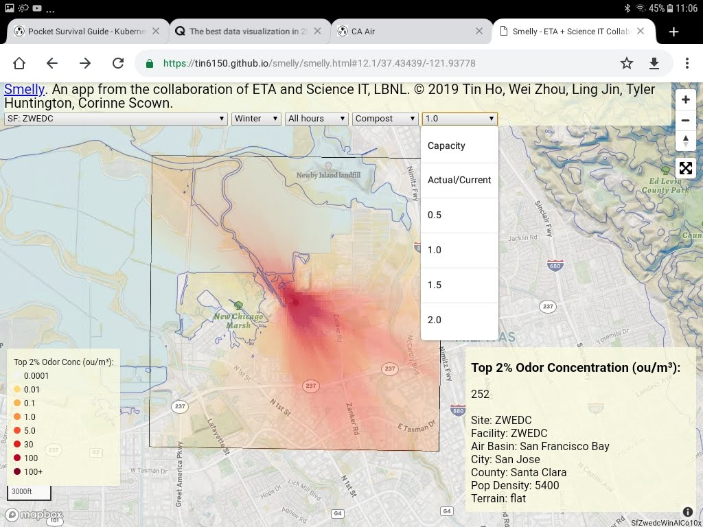

|status1|

.. |status1| image:: https://travis-ci.org/tin6150/smelly.svg?branch=master
    :target: https://travis-ci.org/tin6150/smelly

Smelly
======

Interactive map displaying odor dispersion from various refuse processing sites across California.

This is a web-based application 
from the collaboration of ETA and Sciencie IT, LBNL.
© 2019 Tin Ho, Wei Zhou, Ling Jin, Tyler Huntington, Corinne Scown.

Data is preliminary at this point.
Additional information will soon follow.
Contact: tin (at) lbl.gov

Application accessible at:
https://tin6150.github.io/smelly/smelly.html

